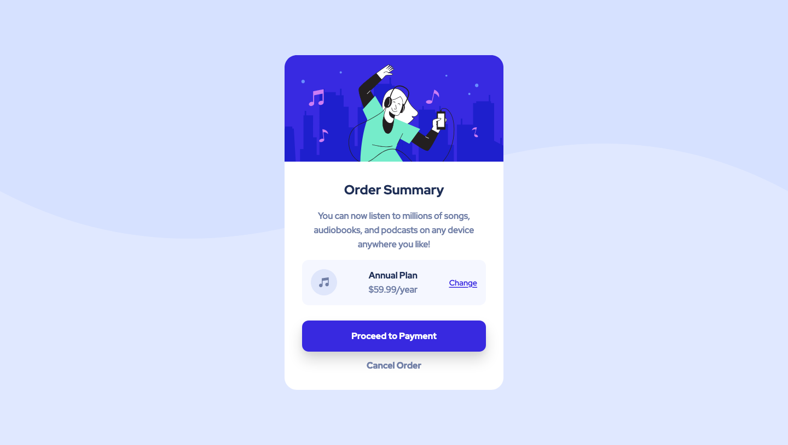

# Order summary card solution

## Table of contents

- [Overview](#overview)
  - [The challenge](#the-challenge)
  - [Screenshot](#screenshot)
  - [Links](#links)
- [My process](#my-process)
  - [Built with](#built-with)
  - [What I learned](#what-i-learned)
  - [Continued development](#continued-development)
  - [Useful resources](#useful-resources)
- [Author](#author)

## Overview

### The challenge

Users should be able to:

- See hover states for interactive elements

### Screenshot

### Links

- Live Site URL: [Live Site](https://modest-panini-5d7a4f.netlify.app/)

## My process

### Built with

- Semantic HTML5 markup
- CSS custom properties
- Flexbox
- Mobile-first workflow

### What I learned

I learned you can use a simple SVG shape combined with a background color to create a clean background pattern. Still practicing mobile-first workflow and flexbox. Just practicing!

To see how you can add code snippets, see below:

## Author

- Frontend Mentor - [@afewfirstnames](https://www.frontendmentor.io/profile/afewfirstnames)
